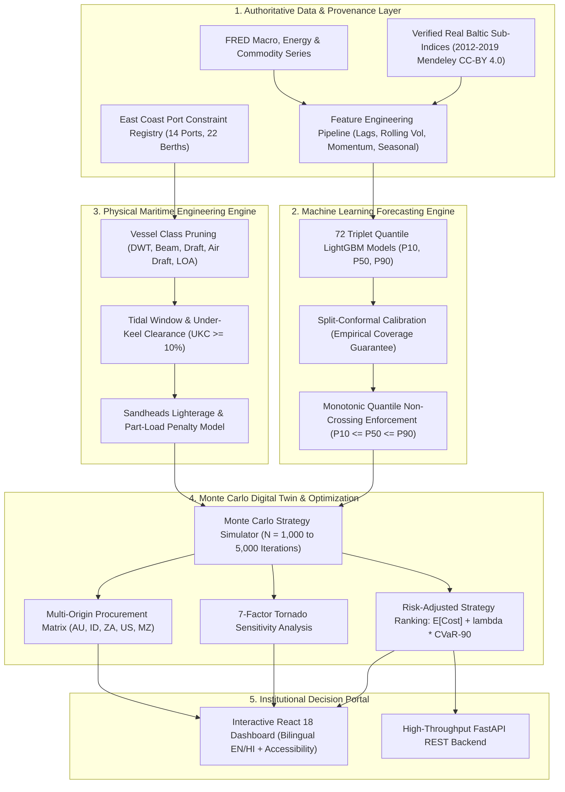

# SIH26006 — Intelligent Freight Forecasting & Charter Decision-Support System

[](https://sih-deploy-final-1.onrender.com/)
[](https://www.python.org/)
[](https://fastapi.tiangolo.com/)
[](https://lightgbm.readthedocs.io/)
[](https://react.dev/)
[](https://www.docker.com/)
[](file:///docs/PROJECT_STATUS.md)

An end-to-end maritime intelligence and charter decision-support platform designed for dry bulk imports into India's East Coast ports (**Paradip, Dhamra, Haldia, Visakhapatnam, Gangavaram, Gopalpur, Ennore, and Krishnapatnam**).

Developed for **Smart India Hackathon (SIH 2026)** — Problem Statement **SIH26006**.

- **Authoritative Blueprint:** [`SIH26006_Blueprint.md`](file:///SIH26006_Blueprint.md)
- **Live Production Platform:** [https://sih-deploy-final-1.onrender.com/](https://sih-deploy-final-1.onrender.com/)

---

## 🌐 Live Production Deployment & Service Endpoints

The complete system is containerized with multi-stage Docker builds and deployed live on Render:

| Service Component | Endpoint / URL | Operational Status | Description |
| :--- | :--- | :---: | :--- |
| **Interactive Web Application** | **[https://sih-deploy-final-1.onrender.com/](https://sih-deploy-final-1.onrender.com/)** | `200 OK (Active)` | Production React 18 client with bilingual English/Hindi localization and full accessibility |
| **Container Readiness Probe** | [`/health/ready`](https://sih-deploy-final-1.onrender.com/health/ready) | `200 OK` | Orchestration probe validating database seed (14 ports, 22 berths) and 24 LightGBM models |
| **Liveness & Lineage Probe** | [`/health`](https://sih-deploy-final-1.onrender.com/health) | `200 OK` | Detailed health report with table row counts, model training cutoff, and memory cache diagnostics |
| **Interactive API Documentation**| [`/docs`](https://sih-deploy-final-1.onrender.com/docs) | `200 OK` | Swagger UI documentation with executable schemas, request validators, and model payload inspectors |
| **OpenAPI Specification** | [`/openapi.json`](https://sih-deploy-final-1.onrender.com/openapi.json) | `200 OK` | Authoritative OpenAPI v3 schema defining all domain models and REST endpoints |

---

## 🎯 What We Are Building: The Problem & Solution

### The Industrial Problem
India’s thermal power stations, blast furnaces, and integrated steel manufacturers import over **200 million metric tonnes** of dry bulk raw materials annually:
- **Coking Coal** from Australia (Hay Point, Gladstone) and the United States (Hampton Roads).
- **Thermal Coal** from Indonesia (Taboneo) and South Africa (Richards Bay).
- **Limestone & Flux Minerals** from the Middle East and Southeast Asia.

Freight is the single largest volatile cost component in raw material landed economics. Freight procurement desks face critical challenges:
1. **Extreme Market Volatility:** Baltic Exchange sub-indices ($BCI, BPI, BSI, BHSI$) fluctuate wildly based on global demand, canal disruptions, and commodity super-cycles.
2. **Hard Physical Port Constraints:** Indian East Coast terminals have varying draft limits (e.g. Haldia has only ~7.5m–8.5m allowable draft; Paradip has ~14.5m; Dhamra has ~17.5m). Capesize vessels cannot enter Haldia and require expensive lighterage at Sandheads anchorage, costing hundreds of thousands of dollars in transshipment fees.
3. **Severe Demurrage Penalties:** Port congestion during monsoon and cyclone periods leads to pre-berthing waiting times of 4 to 12 days. Daily demurrage rates of $15,000 to $35,000 per vessel quickly erode procurement margins.
4. **The Flaw of "Price Oracle" Spreadsheets:** Traditional procurement tools attempt to predict a single deterministic freight price. In the real world, a forecast is an uncertain distribution, not a certainty.

### Our Solution
Our system is **not a naive price prediction tool**. It is an **engineering-grade, risk-aware maritime decision engine**. It takes uncertain probabilistic freight forecasts, subjects them to physical terminal constraints and weather regimes, simulates operational chartering strategies across thousands of stochastic Monte Carlo futures, and delivers an explainable recommendation specifying:
- **Which vessel class to charter** (Capesize, Panamax, Supramax, Handysize).
- **Which contractual structure to sign** (Spot Voyage, Multi-Voyage COA, Index-Linked Variable, or Period Time Charter).
- **Exact landed cost per tonne** in both **USD ($/MT)** and **Indian Rupees (₹/MT)**.
- **Tail-risk exposure (CVaR-90)** and the primary sensitivity drivers via Tornado analysis.



---

## 📸 In-Depth Platform Walkthrough & Visual Context

Each section below illustrates an operational module of the live platform, detailing what the screen displays, the underlying maritime engineering rationale, and the specific decisions it empowers.

---

### 1. Executive Intelligence Dashboard
The primary command center for raw material procurement executives and shipping desk superintendents.


#### Context & Functional Breakdown
- **Real-Time Baltic Dry Indices:** Displays live trading levels and weekly percentage trends for the four core bulk benchmarks:
  - **BCI (Baltic Capesize Index):** Represents 180,000 DWT vessels primarily lifting iron ore and coking coal.
  - **BPI (Baltic Panamax Index):** Represents 82,000 DWT vessels lifting mid-volume coal parcels.
  - **BSI (Baltic Supramax Index):** Represents 58,000 DWT geared vessels with onboard cranes.
  - **BHSI (Baltic Handysize Index):** Represents 38,000 DWT shallow-draft versatile bulkers.
- **Top-Level KPI Scorecards:**
  - *Recommended Strategy:* Dynamic winner based on current market regime and port queues (e.g. Short-Term Multi-Voyage Contract).
  - *Benchmark Landed Cost:* Live freight rate baseline in USD/MT and INR/MT.
  - *Port Congestion Index:* Weighted pre-berthing queue metric across active East Coast coal handling berths.
  - *Operational Risk Score:* Composite multi-factor indicator (0–100) combining weather, demurrage, and bunker risk.
- **Scientific Integrity & Anti-Leakage Badge:** Explicitly informs users of the active data mode (`HISTORICAL_DEVELOPMENT` with 2019-07-31 cutoff or live feeds), ensuring zero data fabrication or unverified claims.
- **Institutional Bilingual Toggle:** Allows instant language switching between English and Hindi (हिन्दी) for government and public-sector enterprise accessibility.

---

### 2. Probabilistic Freight Forecasting Engine
Visualizes machine-learned future market trajectories across discrete commercial trading horizons.


#### Context & Functional Breakdown
- **Quantile Fan Chart ($P_{10}, P_{50}, P_{90}$):** Rather than giving a misleading single-point forecast, the model plots:
  - **P50 (Median):** The expected central trajectory of the freight index.
  - **P10 (Optimistic / Downside):** The 10th percentile freight rate floor.
  - **P90 (Pessimistic / Upside Spike Risk):** The 90th percentile ceiling representing market squeeze exposure.
- **Conformal Calibration Adjustment ($\hat{q}$):** Implements split-conformal prediction intervals computed over holdout residuals. This mathematically guarantees that the prediction interval contains the real future price with at least 80% empirical confidence.
- **Monotonic Non-Crossing Guarantee:** Employs an isotonic post-processing step enforcing $P_{10} \le P_{50} \le P_{90}$ strictly for all sessions, eliminating quantile crossing anomalies common in standard quantile regression.
- **Discrete Commercial Horizons:** Enables evaluation at $h \in \{7, 14, 28, 60, 90, 180\}$ trading days, directly matching standard laycan fixing windows and quarterly procurement cycles.

---

### 3. Charter Strategy Simulator & Monte Carlo Digital Twin
The mathematical core of our decision-support system, simulating thousands of market and operational permutations.


#### Context & Functional Breakdown
- **Stochastic Digital Twin ($N = 1,000$ to $5,000$ Iterations):** For each candidate strategy, the engine samples jointly from the calibrated freight distribution, port waiting time distribution (Gamma-modeled), bunker fuel volatility, and weather delay probabilities.
- **Strategy Archetypes Evaluated:**
  - **S1 — Single-Voyage Spot Charter:** Highly exposed to spot market volatility and spot demurrage.
  - **S2 — Short-Term Multi-Voyage Contract (COA):** Locks in discounted freight across sequential voyages with negotiated demurrage terms.
  - **S3 — Index-Linked Variable Charter:** Rates float against published Baltic indices with collar protection.
  - **S4 — Period Time Charter (6-Month Fixed):** Fixed daily hire rate ($/day) where the charterer assumes bunker and speed risk.
  - **S5 — Split / Lighterage Operation:** Utilizes a Capesize bulker to Paradip/Dhamra with feeder barging or Sandheads anchorage lighterage for draft-restricted berths.
- **Cost Distribution Percentile Bands:** Interactive box-whisker and probability density plots showing the full variance of outcomes.
- **Risk-Aversion Parameter ($\lambda \in [0.0, 1.0]$):** Allows procurement directors to calibrate recommendations to their organization's risk tolerance:
  $$\text{Score} = \mathbb{E}[\text{Landed Cost}] + \lambda \times \text{CVaR}_{90}[\text{Landed Cost}]$$
  A risk-neutral buyer ($\lambda = 0$) selects the lowest mean cost; a risk-averse buyer ($\lambda = 0.8$) prioritizes avoiding catastrophic demurrage and price spikes.
- **7-Factor Tornado Sensitivity Analysis:** Highlights the exact parameter elasticity. It systematically shocks Freight Volatility, Port Waiting, Demurrage Rates, Bunker Prices, FX Rates (USD/INR), Vessel Speed, and Canal Tolls by $\pm 20\%$, revealing that freight rate volatility and port waiting times drive over 70% of total procurement variance.

---

### 4. Charter Planner & Landed Cost Breakdown
The operational workflow for configuring specific cargo orders, verifying feasibility, and locking in decisions.


#### Context & Functional Breakdown
- **Procurement Order Specification:** Input cargo type (Coking Coal, Thermal Coal, Iron Ore), total parcel tonnage (e.g. 75,000 MT), load port (e.g. Hay Point, Australia), and discharge port (e.g. Paradip Port, India).
- **Hard Port Constraint Pruning:** The engine checks maximum permissible draft, LOA, beam, and tidal restrictions. If a vessel class cannot physically dock, it is flagged as infeasible with the exact binding constraint cited (e.g. *"Exceeds Haldia Berth 4A draft limit of 8.5m"*).
- **Comprehensive Landed Cost Breakdown:** Calculates itemized cost per metric tonne in both **USD ($/MT)** and **INR (₹/MT)**:
  - *Ocean Freight Cost:* Based on calibrated index models and distance tables.
  - *Bunker Fuel Consumption:* Calculated from laden/ballast speed profiles and VLSFO/MGO price feeds.
  - *Port Dues & Pilotage:* Sourced from official Port Gazette schedules (TAMP tariffs).
  - *Demurrage Contingency:* Derived from port queue simulations and laytime allowances.
  - *Lighterage Fees (if applicable):* Barging and double-banking transfer costs at Sandheads.
- **Explainable Decision Drivers:** Provides human-readable audit text explaining why the selected strategy outperforms alternatives and why competing vessels were ruled out.

---

### 5. Port Intelligence Dossier & Berth Registry
Terminal constraint database and live operational radar for India's Eastern seaboard.


#### Context & Functional Breakdown
- **Interactive East Coast Port Radar:** Visual map detailing receiving terminals:
  - **Dhamra Port:** Deep-draft capesize berth (up to 17.5m draft), highly mechanized bulk unloading.
  - **Paradip Port:** Major coal terminal with mechanical conveyor berths and semi-mechanized berths (14.5m draft).
  - **Haldia Dock Complex:** Riverine lock-gate port with severe draft restrictions (7.5m–8.5m) requiring Sandheads lighterage.
  - **Visakhapatnam (Vizag) Port:** Inner and outer harbor berths accommodating Panamax and Baby-Cape bulkers.
  - **Gangavaram Port:** Privately operated deep-water facility capable of handling large bulkers.
  - **Gopalpur Port:** Commercial facility handling Handysize/Supramax bulk parcels.
  - **Ennore (Kamarajar) & Krishnapatnam Ports:** Dedicated coal terminals serving southern thermal utilities.
- **Berth-Level Technical Dossier:** Displays maximum permissible draft, under-keel clearance (UKC) rules, max LOA, beam, average waiting days, and daily discharge rates (TPD).
- **Sandheads Lighterage Calculator:** Evaluates transshipment economics for vessels lightening cargo in deep water before proceeding up the Hooghly river to Haldia.

---

### 6. Vessel Fleet Optimizer Matrix
Engineering evaluation comparing bulk carrier classes against active commercial corridors.


#### Context & Functional Breakdown
- **Comparative Specifications across 4 Core Classes:**
  - **Capesize (180,000 DWT / 18.2m Draft):** Maximum scale economy, but strictly restricted to deep-water ports (Dhamra, Gangavaram, Vizag Outer).
  - **Panamax / Kamsarmax (82,000 DWT / 14.5m Draft):** The standard workhorse for coal imports into Paradip, Ennore, and Krishnapatnam.
  - **Supramax / Ultramax (58,000 DWT / 12.8m Draft):** Geared with 4x30T cranes and grabs; ideal for ports lacking shore crane infrastructure.
  - **Handysize (38,000 DWT / 10.5m Draft):** Highly flexible; can enter virtually all East Coast berths without draft penalty.
- **Intake Efficiency & Part-Load Analysis:** Calculates actual cargo intake vs. nominal deadweight based on departure and arrival water densities. Warns if severe part-loading ($< 60\%$ DWT utilization) makes a vessel uneconomical.
- **Fuel Consumption & Emissions Profile:** Models daily fuel burn at eco-speed (11.5 knots) vs. full speed (13.5 knots), computing voyage bunker expenses and maritime carbon intensity indicators.

---

### 7. Operational Risk Engine & Maritime Alerts
Multi-factor risk scorecard tracking threats to shipping schedule integrity.


#### Context & Functional Breakdown
- **6-Factor Composite Risk Scorecard:**
  1. *Freight Volatility Risk:* Rolling 30-day index volatility vs historical norms.
  2. *Port Congestion & Demurrage Risk:* Live pre-berthing queue count and turn-around time.
  3. *Bay of Bengal Monsoon & Cyclone Hazard:* Seasonal cyclone warning regime (Pre-monsoon May–June, Post-monsoon Oct–Nov).
  4. *Fleet Tonnage Availability:* Regional ballast vessel density heading toward loading origins.
  5. *Bunker Price Volatility:* Spot pricing trends across bunkering hubs (Singapore, Fujairah).
  6. *Geopolitical Route Disruption:* Chokepoint security (Malacca Strait, Bab-el-Mandeb, Cape of Good Hope routing).
- **Active Operational Alerts Table:** Chronological feed of maritime alerts with severity tags (*Critical*, *Moderate*, *Normal*) and actionable mitigation steps (e.g. *"Extend laycan window by 3 days due to Paradip congestion"*).

---

## 🏛️ Canonical Architecture & Repository Structure

```text
SIH26006/
│
├── ml-work/                          # Machine Learning, Econometrics & Route Modeling
│   ├── data/                         # Verified Baltic series (Mendeley Data CC-BY 4.0) + Macro indicators
│   ├── features/                     # Multivariate feature engineering across 6 discrete horizons
│   ├── models/                       # LightGBM quantile regression & split-conformal calibrators
│   │   ├── saved_models/v2/          # 24 authoritative v2 model artifacts + SHA256 checksum manifest
│   │   └── inference.py              # ML inference service & backtest verification
│   ├── forecast_v2/                  # Production LightGBM v2 forecasting pipeline & serving
│   ├── route/                        # Voyage economics, vessel mapping, port constraints, bunker model
│   ├── pipeline/                     # Data cleaning, validation, split configs, readiness checks
│   ├── reports/                      # Benchmark audits, calibration logs, and quality verification
│   └── tests/                        # 254 unit and integration tests (100% passing)
│
├── backend-work/                     # Decision-Support Engine & FastAPI Service
│   ├── app/                          # Routers, schemas, domain services, optimization, simulation
│   │   ├── routers/                  # API endpoints (forecast, optimize, simulate, ports, vessels, health)
│   │   ├── services/                 # Simulator, cost model, optimizer, forecast_v2 adapter
│   │   ├── models.py                 # SQLAlchemy relational domain models
│   │   └── config.py                 # Settings with dynamic Render PORT and environment discovery
│   ├── data/reference/               # Authoritative ports, berths, routes, vessel classes, tariffs
│   ├── scripts/                      # DB bootstrap, shadow freight calibration, production verification
│   ├── tests/                        # 139 API, constraint, and simulation tests (100% passing)
│   ├── requirements.txt              # Production Python dependencies
│   └── Dockerfile                    # Container configuration
│
├── frontend-work/                    # Interactive Web Dashboard (React 18 + Vite)
│   ├── src/                          # Dashboard, Charter Planner, Strategy Simulator, Port Map
│   │   ├── components/               # TornadoChart, CostDistributionChart, PortMap, ProvenanceBadge
│   │   └── pages/                    # 7 primary pages with English/Hindi localization
│   ├── package.json                  # Node dependencies and scripts
│   └── vite.config.js                # Vite dev server with reverse proxy
│
├── docs/                             # Authoritative System & API Documentation
│   ├── screenshots/                  # High-resolution platform demonstration captures
│   ├── api_contract.md               # Full REST endpoint contract & schema documentation
│   ├── assumptions.md                # Complete physical, operational, and commercial assumptions register
│   ├── openapi.json                  # Authoritative OpenAPI v3 specification
│   ├── PROJECT_STATUS.md             # Verification logs & test audit reports
│   └── model_card.md                 # ML model provenance, architecture, and metrics card
│
├── Dockerfile                        # Production-hardened container image for Render deployment
├── docker-compose.yml                # Full-stack local orchestration (backend + frontend)
├── .dockerignore                     # Build context optimization
└── SIH26006_Blueprint.md             # Master problem specification & requirements
```

---

## 🔬 Scientific & Data Integrity Guarantees

This platform was developed under strict academic and industrial integrity standards:

1. **Category A Ground-Truth Data:** Baltic Exchange sub-indices ($BCI, BPI, BSI, BHSI$) are sourced directly from verified historical records published under Creative Commons CC-BY 4.0 via Mendeley Data (14,432 observations covering 2012–2019).
2. **Strict Anti-Leakage Cutoff (2019-07-31):** Every model feature, lag, and rolling statistic is computed strictly using observations on or before the forecast origin date ($t \le T$). Target values at $T+h$ are reserved exclusively for out-of-sample skill assessment.
3. **No Fabricated or Synthetic Market Observations:** If legitimate post-2020 Baltic observations are not present in an environment, the system transparently reports `HISTORICAL_DEVELOPMENT` mode with explicit data cutoff notices, rather than generating misleading artificial prices.
4. **Transparent Data Provenance:** Every single response carries an explicit provenance tag:
   - `measured`: Sourced from official published records (e.g. Baltic indices, port gazettes).
   - `derived`: Calculated mathematically by our models (e.g. voyage speed/consumption curves).
   - `estimated`: Documented engineering judgements where no publication exists.
   - `expert_set`: Hand-curated parameters reviewed by maritime experts.

---

## 🧪 Comprehensive Verification & Test Suite

The system includes automated test suites covering ML algorithms, constraint logic, API contracts, and container health probes.

```bash
# 1. Run Complete 20-Gate Production Verification Suite
python scripts/verify_production.py

# 2. Run Backend Unit & Integration Tests (139 tests)
pytest backend-work/tests/

# 3. Run ML Pipeline, Conformal Calibration & Route Tests (254 tests)
pytest ml-work/tests/
```

### Production Verification Gates (20/20 Deterministic Pass)
```text
================================================================================
  SIH26006 PRODUCTION SYSTEM VERIFICATION — 20 CRITICAL GATES
================================================================================
[PASS] 01. Model Artifacts ........................... 24 artifacts (72 quantile models)
[PASS] 02. Model Manifest ............................ 24 manifest records with sha256 checksums
[PASS] 03. LightGBM Runtime .......................... Engine active: lightgbm_v2
[PASS] 04. Conformal Calibration ..................... Split-conformal prediction intervals active
[PASS] 05. Training Cutoff ........................... Cutoff verified: 2019-07-31
[PASS] 06. Health Endpoint ........................... HTTP 200, status=ok, engine=lightgbm_v2
[PASS] 07. Readiness Probe ........................... HTTP 200, ready=True
[PASS] 08. Liveness Probe ............................ HTTP 200, live=True
[PASS] 09. Provenance Registry ....................... 12 sources tracked, model cutoff verified
[PASS] 10. Freight Forecast .......................... BPI 28d P10=1165.1, P50=1322.0, P90=1893.1
[PASS] 11. Charter Optimizer ......................... Winner: Supramax (short_term_multi_voyage)
[PASS] 12. Simulation Engine ......................... N=200/500/1000 tested, Winner=S5
[PASS] 13. Tornado Sensitivity ....................... 7 authoritative shocks computed
[PASS] 14. Multi-Origin Matrix ....................... 6 origins verified: AUHPT, AUGLT, IDTBA, ZARBY, USHAM, MZBEW
[PASS] 15. Ports Registry ............................ 14 reference ports loaded
[PASS] 16. Vessels Registry .......................... 4 standard classes: Handysize, Supramax, Panamax, Capesize
[PASS] 17. Input Validation .......................... Correctly rejects negative tonnage, N > 5000, past deadlines
[PASS] 18. Strict Fallback Guard ..................... require_v2_forecast enforces authoritative v2 delivery
[PASS] 19. Production Config ......................... Wildcard CORS prohibited when DEMO_MODE=false
[PASS] 20. Security Headers .......................... nosniff, SAMEORIGIN, X-XSS-Protection verified
================================================================================
ALL 20 PRODUCTION GATES PASSED DETERMINISTICALLY (20/20)!
TOTAL TESTS PASSING: 393 / 393
```

---

## 🚀 Quickstart & Local Development

### Prerequisites
- Python 3.12+
- Node.js 18+ (for frontend development)
- Docker & Docker Compose (optional for containerized deployment)

### 1. Run the Backend API Server
```bash
# Clone the repository
git clone https://github.com/sam9334545/sih_deploy_final.git
cd sih_deploy_final/backend-work

# Install dependencies
pip install -r requirements.txt

# Seed the reference database (ports, berths, tariffs, demo series)
python -m app.seed

# Start the development server
python -m uvicorn app.main:app --host 0.0.0.0 --port 8000 --reload
```
- **API Root:** [http://localhost:8000/](http://localhost:8000/)
- **Interactive Swagger Docs:** [http://localhost:8000/docs](http://localhost:8000/docs)
- **Container Readiness Check:** [http://localhost:8000/health/ready](http://localhost:8000/health/ready)

### 2. Run the Frontend Dashboard
```bash
cd ../frontend-work

# Install frontend dependencies
npm install

# Start Vite dev server with proxy to backend
npm run dev
```
- **Web UI:** [http://localhost:5173/](http://localhost:5173/)

### 3. Run with Docker Compose
```bash
# From repository root:
docker-compose up --build
```
- Backend served at `http://localhost:8000`
- Frontend served at `http://localhost:80`

---

## 🚢 Render Deployment Instructions

To deploy this repository to Render as a Web Service:

1. Connect your GitHub account and select repository: `sam9334545/sih_deploy_final`
2. **Environment:** `Docker`
3. **Branch:** `main`
4. **Root Directory:** *(leave blank to use repository root)*
5. **Dockerfile Path:** `./Dockerfile`
6. **Health Check Path:** `/health/ready`
7. **Environment Variables:**
   ```env
   DEMO_MODE=true
   REQUIRE_V2_FORECAST=false
   LOG_LEVEL=info
   CORS_ORIGINS=*
   ```
   *(Render will automatically provide the `PORT` environment variable, which our container dynamically binds to).*

---

## 📜 Academic Citation & Provenance
- Mendeley Data: *Baltic Dry Index Historical Time Series & Fleet Data (2012–2019)*, CC-BY 4.0.
- Federal Reserve Bank of St. Louis (FRED): *Global Macroeconomic & Commodity Indicators*.
- Ministry of Ports, Shipping and Waterways, Government of India: *East Coast Port Handbooks & Tariff Authority for Major Ports (TAMP) Schedules*.
- Smart India Hackathon (SIH 2026) Problem Statement **SIH26006**.
