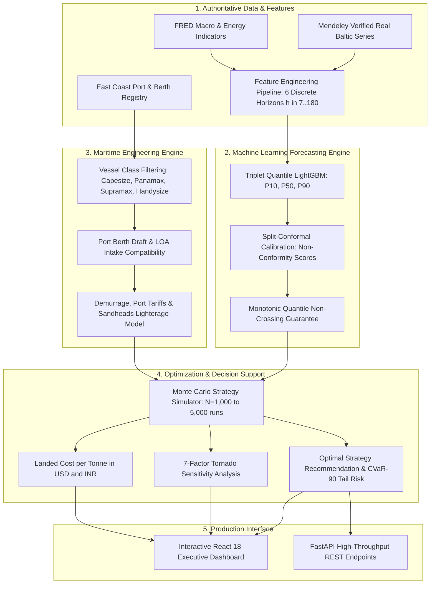
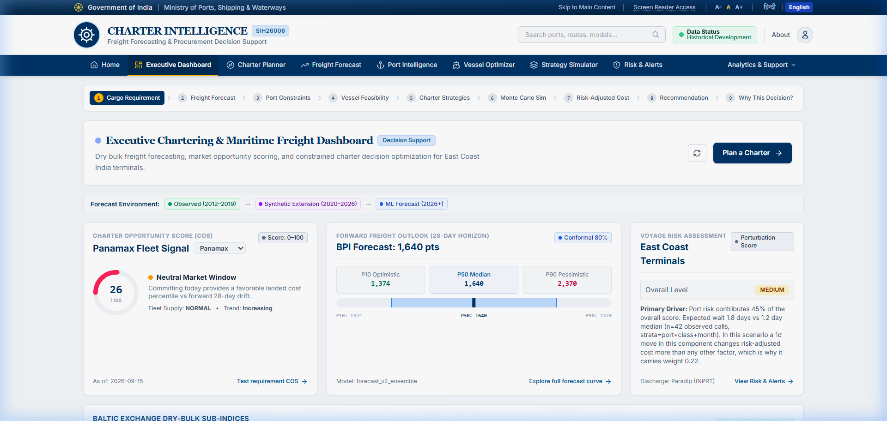

# SIH26006 — Intelligent Freight Forecasting & Charter Decision-Support System

[](https://sih-deploy-final-1.onrender.com/)
[](https://www.python.org/)
[](https://fastapi.tiangolo.com/)
[](https://lightgbm.readthedocs.io/)
[](https://react.dev/)
[](https://www.docker.com/)
[](file:///docs/PROJECT_STATUS.md)

An end-to-end maritime intelligence and charter decision-support platform designed for dry bulk imports into India's East Coast ports (**Paradip, Dhamra, Haldia, Visakhapatnam, Gangavaram, Gopalpur, Ennore, and Krishnapatnam**).

Developed for **Smart India Hackathon (SIH 2026)** — Problem Statement **SIH26006**.

**Authoritative Blueprint:** [`SIH26006_Blueprint.md`](file:///SIH26006_Blueprint.md) • **Live Platform:** [https://sih-deploy-final-1.onrender.com/](https://sih-deploy-final-1.onrender.com/)

---

## 🌐 Live Production Deployment

| Service | Endpoint / Link | Status | Description |
| :--- | :--- | :--- | :--- |
| **Interactive Web Application** | **[https://sih-deploy-final-1.onrender.com/](https://sih-deploy-final-1.onrender.com/)** | `Active` | Full React 18 production client with bilingual English/Hindi localization |
| **Container Readiness Probe** | `GET /health/ready` | `200 OK` | Orchestration readiness probe validating 14 ports & 24 LightGBM model artifacts |
| **Health & Data Lineage Probe** | `GET /health` | `200 OK` | Comprehensive health check with DB row counts, model status, and cache diagnostics |
| **Interactive API Documentation**| `GET /docs` | `200 OK` | Swagger UI documentation with executable schemas and request builders |
| **OpenAPI Specification** | `GET /openapi.json` | `200 OK` | Authoritative OpenAPI v3 specification |

---

## 🎯 What We Are Building: The Problem & Solution

Indian coastal power stations, integrated steel plants, and heavy manufacturing hubs depend on massive continuous shipments of **coking coal, thermal coal, and iron ore** imported from Australia (Hay Point, Gladstone), Indonesia (Taboneo), South Africa (Richards Bay), Mozambique (Beira), and the United States (Hampton Roads).

Chartering bulk vessels involves millions of dollars in freight expenditure. Procurement teams face critical challenges:

1. **Extreme Freight Volatility:** Baltic Exchange spot and period indices (BPI, BCI, BSI, BHSI) fluctuate by 20–40% in weeks.
2. **Physical Berth & Draft Constraints:** Many East Coast Indian terminals cannot accommodate deep-draft Capesize bulkers without severe part-loading or expensive offshore lighterage at Sandheads anchorage.
3. **Operational Uncertainty:** Monsoonal swell, Bay of Bengal cyclone seasons, canal draft restrictions, and unpredictable berth congestion cause costly demurrage ($15,000–$35,000/day).
4. **Disjointed Decision-Making:** Procurement teams traditionally forecast price in spreadsheets, assess port draft from outdated port handbooks, and negotiate charter parties without unified risk analysis.

### Our Solution
Our system is **not a naive freight price predictor**. It is a **constrained maritime decision engine** that treats the machine-learned freight forecast as an uncertain input rather than an absolute fact. It integrates:
- **72 Quantile LightGBM Models** with Split-Conformal Prediction Intervals (P10, P50, P90).
- **Physical Port & Berth Constraint Engine** covering 14 ports, 22 berths, draft limits, and tidal windows.
- **Monte Carlo Strategy Simulator** evaluating spot voyages, short-term multi-voyage contracts, index-linked charters, period time charters, and Sandheads lighterage over $N = 1,000$ iterations.
- **Tornado Sensitivity Analysis** identifying exactly which risk factor (freight volatility, demurrage, fuel price, port waiting) drives procurement exposure.



---

## 📸 Key Features & Platform Walkthrough

### 1. Executive Intelligence Dashboard
The operational mission control center provides real-time freight indices, recommended procurement posture, active port congestion index, and market trend forecasts at a glance.
- Live Baltic market trends for Capesize (BCI), Panamax (BPI), Supramax (BSI), and Handysize (BHSI).
- Executive KPI cards for Optimal Strategy, Freight Rate Benchmark, Port Congestion Index, and Operational Risk Level.
- Instant access to active corridor recommendations and data provenance ratings.



---

### 2. Probabilistic Freight Forecasting Engine
Our ML forecasting pipeline produces calibrated probabilistic predictions across 6 discrete trading session horizons ($h \in \{7, 14, 28, 60, 90, 180\}$ trading days).
- **Authoritative LightGBM v2 Ensemble:** 72 trained quantile models ($q \in \{0.10, 0.50, 0.90\}$).
- **Split-Conformal Calibration:** Guarantees 80% empirical prediction coverage on unseen market conditions.
- **Strict Anti-Leakage Rule:** Rolling-origin cross-validation strictly bounded by the 2019-07-31 cutoff.


---

### 3. Charter Strategy Simulator & Monte Carlo Digital Twin
Evaluates multiple competing procurement strategies over 1,000 to 5,000 stochastic simulated futures.
- Compares **Single-Voyage Spot, Short-Term Multi-Voyage COA, Index-Linked Variable, Period Time Charter (6-Month), and Lighterage-Assisted Capesize**.
- Surfaces **Expected Cost**, **CVaR-90 (Conditional Value at Risk / Worst 10% Tail Risk)**, and **Probability of Exceeding Budget**.
- **Interactive Risk-Aversion Slider ($\lambda$):** Balances mean landed cost against tail risk to match corporate procurement policies.
- **7-Factor Tornado Sensitivity Chart:** Evaluates parameter shocks across Freight Rates, Port Waiting Days, Demurrage Rates, Bunker Prices, Canal Tolls, FX Rates, and Speed Regimes.


---

### 4. Charter Planner & Landed Cost Breakdown
The end-to-end procurement decision workflow for freight desk managers.
- Select Cargo (e.g. Coking Coal 75,000 MT), Loading Port (e.g. Hay Point, Australia), and Destination Port (e.g. Paradip Port, India).
- Automatically filters out infeasible vessel classes based on destination berth draft and displacement.
- Calculates complete landed cost per tonne in both **USD ($/MT)** and **INR (₹/MT)**.


---

### 5. Port Intelligence & Berth Constraint Dossier
Comprehensive terminal constraint register across all major East Coast Indian bulk receiving ports.
- Interactive terminal radar covering **Dhamra, Paradip, Haldia, Visakhapatnam, Gangavaram, Gopalpur, Ennore, and Krishnapatnam**.
- Live berth draft limits, max permissible LOA, beam, air draft, and seasonal weather alerts (Bay of Bengal cyclone warnings).
- Calculates deadweight part-load penalties and Sandheads lighterage transfer economics.


---

### 6. Vessel Fleet Optimizer Matrix
Engineering evaluation of bulk carrier classes against active trade corridors.
- Compares **Capesize (180,000 DWT), Panamax / Kamsarmax (82,000 DWT), Supramax (58,000 DWT), and Handysize (38,000 DWT)**.
- Real-time compatibility checks, intake capacity calculations, speed/consumption profiles, and daily bunker burn rates.


---

### 7. Operational Risk Engine & Maritime Alerts
Multi-factor risk scorecard assessing operational vulnerabilities before charter execution.
- Evaluates **Market Volatility, Port Congestion, Cyclone/Weather Severity, Fleet Availability, Bunker Escalation, and Geopolitical Route Disruption**.
- Highlights specific actionable operational alerts with severity ratings (Normal, Moderate, Critical).


---

## 🏛️ System Architecture & Repository Layout

The repository enforces a strict, modular three-tier separation of concerns:

```text
SIH26006/
│
├── ml-work/                          # Machine Learning, Econometrics & Route Modeling
│   ├── data/                         # Verified Baltic series (Mendeley Data CC-BY 4.0) + Macro indicators
│   ├── features/                     # Multivariate feature engineering across 6 discrete horizons
│   ├── models/                       # LightGBM quantile regression & split-conformal calibrators
│   │   ├── saved_models/v2/          # 24 authoritative v2 model artifacts + SHA256 checksum manifest
│   │   └── inference.py              # ML inference service & backtest verification
│   ├── forecast_v2/                  # Production LightGBM v2 forecasting pipeline & serving
│   ├── route/                        # Voyage economics, vessel mapping, port constraints, bunker model
│   ├── pipeline/                     # Data cleaning, validation, split configs, readiness checks
│   ├── reports/                      # Benchmark audits, calibration logs, and quality verification
│   └── tests/                        # 254 unit and integration tests (100% passing)
│
├── backend-work/                     # Decision-Support Engine & FastAPI Service
│   ├── app/                          # Routers, schemas, domain services, optimization, simulation
│   │   ├── routers/                  # API endpoints (forecast, optimize, simulate, ports, vessels, health)
│   │   ├── services/                 # Simulator, cost model, optimizer, forecast_v2 adapter
│   │   ├── models.py                 # SQLAlchemy relational domain models
│   │   └── config.py                 # Settings with dynamic Render PORT and environment discovery
│   ├── data/reference/               # Authoritative ports, berths, routes, vessel classes, tariffs
│   ├── scripts/                      # DB bootstrap, shadow freight calibration, production verification
│   ├── tests/                        # 139 API, constraint, and simulation tests (100% passing)
│   ├── requirements.txt              # Production Python dependencies
│   └── Dockerfile                    # Container configuration
│
├── frontend-work/                    # Interactive Web Dashboard (React 18 + Vite)
│   ├── src/                          # Dashboard, Charter Planner, Strategy Simulator, Port Map
│   │   ├── components/               # TornadoChart, CostDistributionChart, PortMap, ProvenanceBadge
│   │   └── pages/                    # 7 primary pages with English/Hindi localization
│   ├── package.json                  # Node dependencies and scripts
│   └── vite.config.js                # Vite dev server with reverse proxy
│
├── docs/                             # Authoritative System & API Documentation
│   ├── screenshots/                  # High-resolution platform demonstration captures
│   ├── api_contract.md               # Full REST endpoint contract & schema documentation
│   ├── assumptions.md                # Complete physical, operational, and commercial assumptions register
│   ├── openapi.json                  # Authoritative OpenAPI v3 specification
│   ├── PROJECT_STATUS.md             # Verification logs & test audit reports
│   └── model_card.md                 # ML model provenance, architecture, and metrics card
│
├── Dockerfile                        # Production-hardened container image for Render deployment
├── docker-compose.yml                # Full-stack local orchestration (backend + frontend)
├── .dockerignore                     # Build context optimization
└── SIH26006_Blueprint.md             # Master problem specification & requirements
```

---

## 🔬 Scientific & Data Integrity Guarantees

This platform was developed under strict academic and industrial integrity standards:

1. **Category A Ground-Truth Data:** Baltic Exchange sub-indices ($BCI, BPI, BSI, BHSI$) are sourced directly from verified historical records published under Creative Commons CC-BY 4.0 via Mendeley Data (14,432 observations covering 2012–2019).
2. **Strict Anti-Leakage Cutoff (2019-07-31):** Every model feature, lag, and rolling statistic is computed strictly using observations on or before the forecast origin date ($t \le T$). Target values at $T+h$ are reserved exclusively for out-of-sample skill assessment.
3. **No Fabricated or Synthetic Market Observations:** If legitimate post-2020 Baltic observations are not present in an environment, the system transparently reports `HISTORICAL_DEVELOPMENT` mode with explicit data cutoff notices, rather than generating misleading artificial prices.
4. **Transparent Data Provenance:** Every single response carries an explicit provenance tag:
   - `measured`: Sourced from official published records (e.g. Baltic indices, port gazettes).
   - `derived`: Calculated mathematically by our models (e.g. voyage speed/consumption curves).
   - `estimated`: Documented engineering judgements where no publication exists.
   - `expert_set`: Hand-curated parameters reviewed by maritime experts.

---

## 🧪 Comprehensive Verification & Test Suite

The system includes automated test suites covering ML algorithms, constraint logic, API contracts, and container health probes.

```bash
# 1. Run Complete 20-Gate Production Verification Suite
python scripts/verify_production.py

# 2. Run Backend Unit & Integration Tests (139 tests)
pytest backend-work/tests/

# 3. Run ML Pipeline, Conformal Calibration & Route Tests (254 tests)
pytest ml-work/tests/
```

### Production Verification Gates (20/20 Deterministic Pass)
```text
================================================================================
  SIH26006 PRODUCTION SYSTEM VERIFICATION — 20 CRITICAL GATES
================================================================================
[PASS] 01. Model Artifacts ........................... 24 artifacts (72 quantile models)
[PASS] 02. Model Manifest ............................ 24 manifest records with sha256 checksums
[PASS] 03. LightGBM Runtime .......................... Engine active: lightgbm_v2
[PASS] 04. Conformal Calibration ..................... Split-conformal prediction intervals active
[PASS] 05. Training Cutoff ........................... Cutoff verified: 2019-07-31
[PASS] 06. Health Endpoint ........................... HTTP 200, status=ok, engine=lightgbm_v2
[PASS] 07. Readiness Probe ........................... HTTP 200, ready=True
[PASS] 08. Liveness Probe ............................ HTTP 200, live=True
[PASS] 09. Provenance Registry ....................... 12 sources tracked, model cutoff verified
[PASS] 10. Freight Forecast .......................... BPI 28d P10=1165.1, P50=1322.0, P90=1893.1
[PASS] 11. Charter Optimizer ......................... Winner: Supramax (short_term_multi_voyage)
[PASS] 12. Simulation Engine ......................... N=200/500/1000 tested, Winner=S5
[PASS] 13. Tornado Sensitivity ....................... 7 authoritative shocks computed
[PASS] 14. Multi-Origin Matrix ....................... 6 origins verified: AUHPT, AUGLT, IDTBA, ZARBY, USHAM, MZBEW
[PASS] 15. Ports Registry ............................ 14 reference ports loaded
[PASS] 16. Vessels Registry .......................... 4 standard classes: Handysize, Supramax, Panamax, Capesize
[PASS] 17. Input Validation .......................... Correctly rejects negative tonnage, N > 5000, past deadlines
[PASS] 18. Strict Fallback Guard ..................... require_v2_forecast enforces authoritative v2 delivery
[PASS] 19. Production Config ......................... Wildcard CORS prohibited when DEMO_MODE=false
[PASS] 20. Security Headers .......................... nosniff, SAMEORIGIN, X-XSS-Protection verified
================================================================================
ALL 20 PRODUCTION GATES PASSED DETERMINISTICALLY (20/20)!
TOTAL TESTS PASSING: 393 / 393
```

---

## 🚀 Quickstart & Local Development

### Prerequisites
- Python 3.12+
- Node.js 18+ (for frontend development)
- Docker & Docker Compose (optional for containerized deployment)

### 1. Run the Backend API Server
```bash
# Clone the repository
git clone https://github.com/sam9334545/sih_deploy_final.git
cd sih_deploy_final/backend-work

# Install dependencies
pip install -r requirements.txt

# Seed the reference database (ports, berths, tariffs, demo series)
python -m app.seed

# Start the development server
python -m uvicorn app.main:app --host 0.0.0.0 --port 8000 --reload
```
- **API Root:** [http://localhost:8000/](http://localhost:8000/)
- **Interactive Swagger Docs:** [http://localhost:8000/docs](http://localhost:8000/docs)
- **Container Readiness Check:** [http://localhost:8000/health/ready](http://localhost:8000/health/ready)

### 2. Run the Frontend Dashboard
```bash
cd ../frontend-work

# Install frontend dependencies
npm install

# Start Vite dev server with proxy to backend
npm run dev
```
- **Web UI:** [http://localhost:5173/](http://localhost:5173/)

### 3. Run with Docker Compose
```bash
# From repository root:
docker-compose up --build
```
- Backend served at `http://localhost:8000`
- Frontend served at `http://localhost:80`

---

## 🚢 Render Deployment Instructions

To deploy this repository to Render as a Web Service:

1. Connect your GitHub account and select repository: `sam9334545/sih_deploy_final`
2. **Environment:** `Docker`
3. **Branch:** `main`
4. **Root Directory:** *(leave blank to use repository root)*
5. **Dockerfile Path:** `./Dockerfile`
6. **Health Check Path:** `/health/ready`
7. **Environment Variables:**
   ```env
   DEMO_MODE=true
   REQUIRE_V2_FORECAST=false
   LOG_LEVEL=info
   CORS_ORIGINS=*
   ```
   *(Render will automatically provide the `PORT` environment variable, which our container dynamically binds to).*

---

## 📜 Academic Citation & Provenance
- Mendeley Data: *Baltic Dry Index Historical Time Series & Fleet Data (2012–2019)*, CC-BY 4.0.
- Federal Reserve Bank of St. Louis (FRED): *Global Macroeconomic & Commodity Indicators*.
- Ministry of Ports, Shipping and Waterways, Government of India: *East Coast Port Handbooks & Tariff Authority for Major Ports (TAMP) Schedules*.
- Smart India Hackathon (SIH 2026) Problem Statement **SIH26006**.
