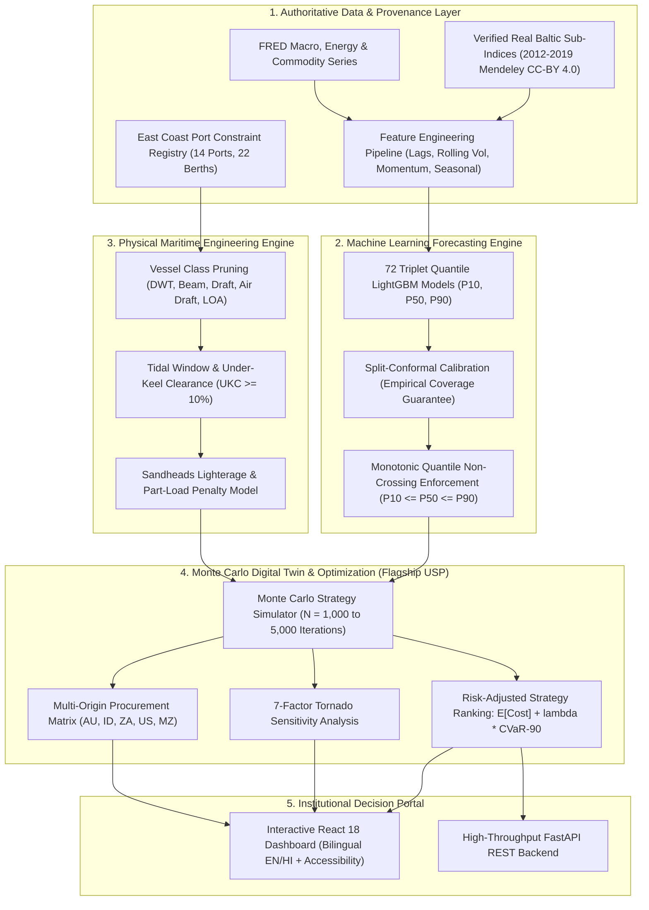
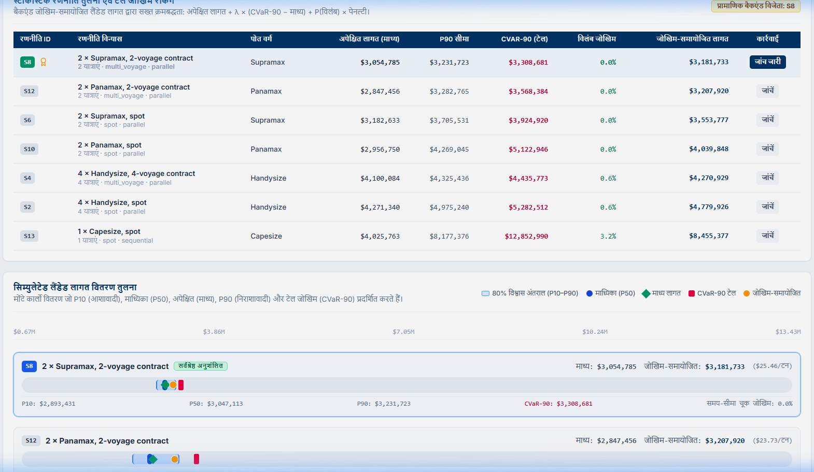
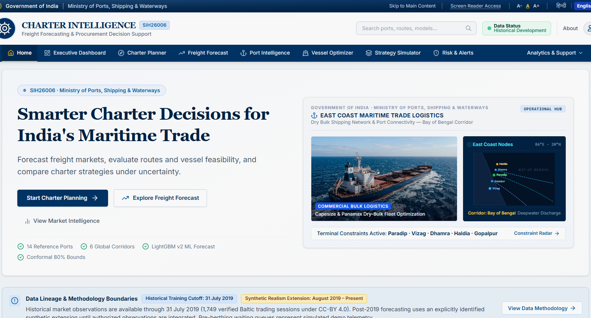
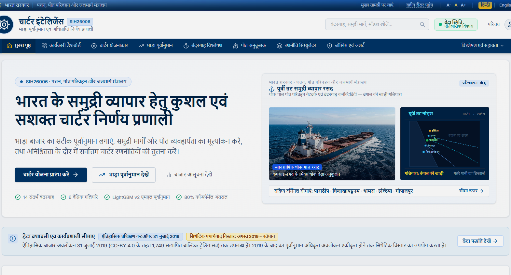
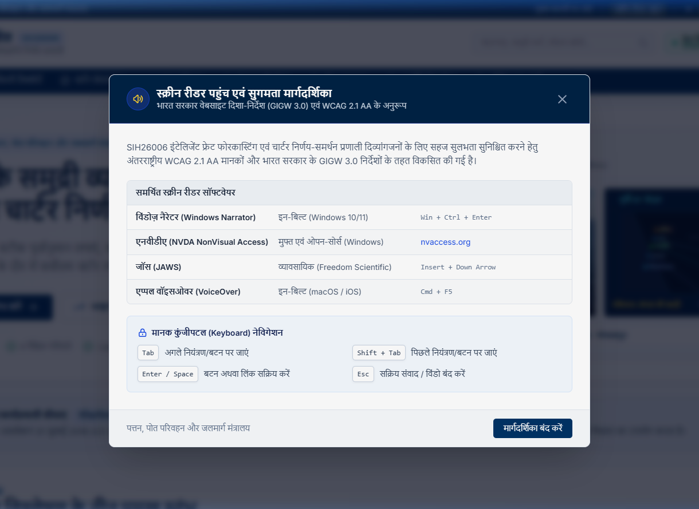
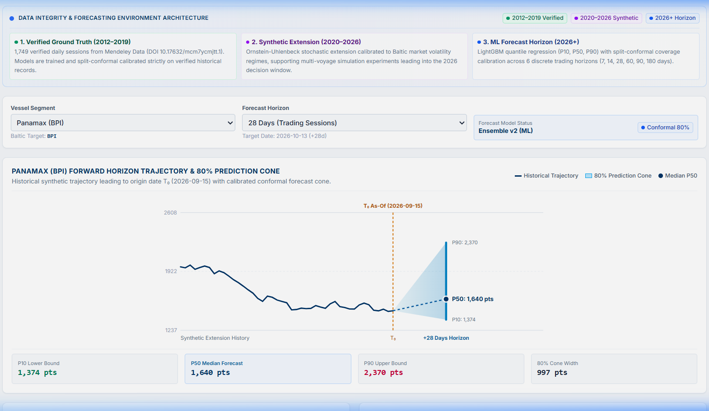
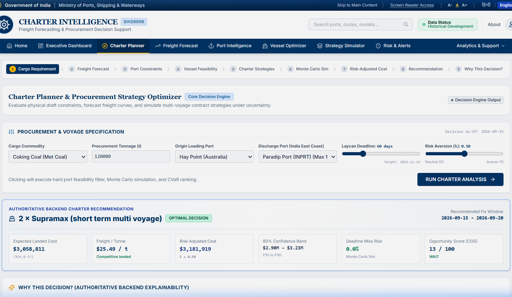
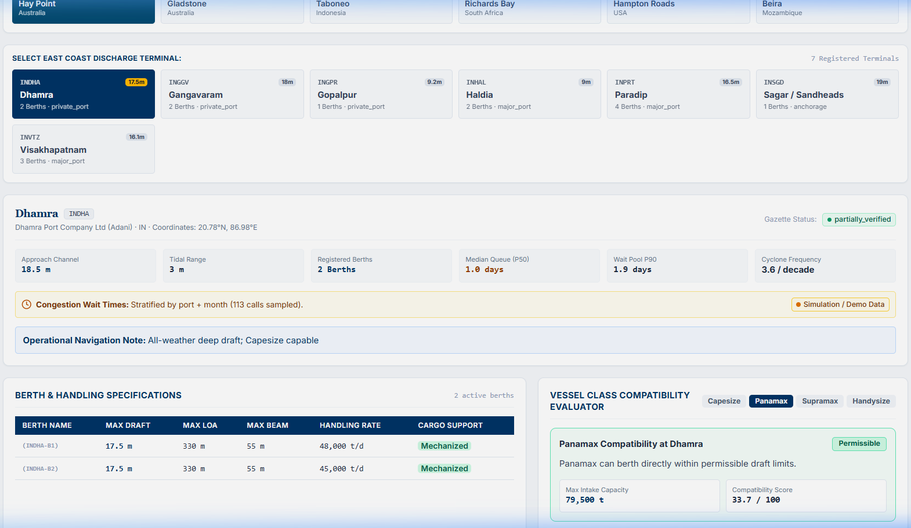
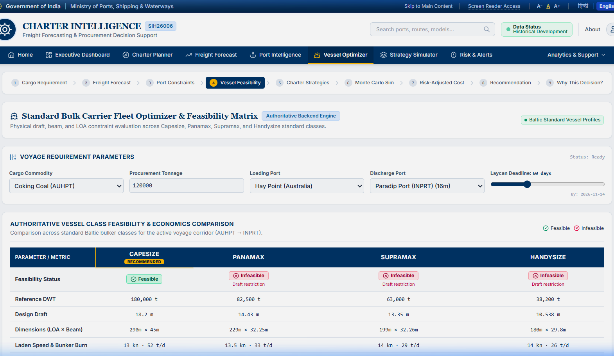
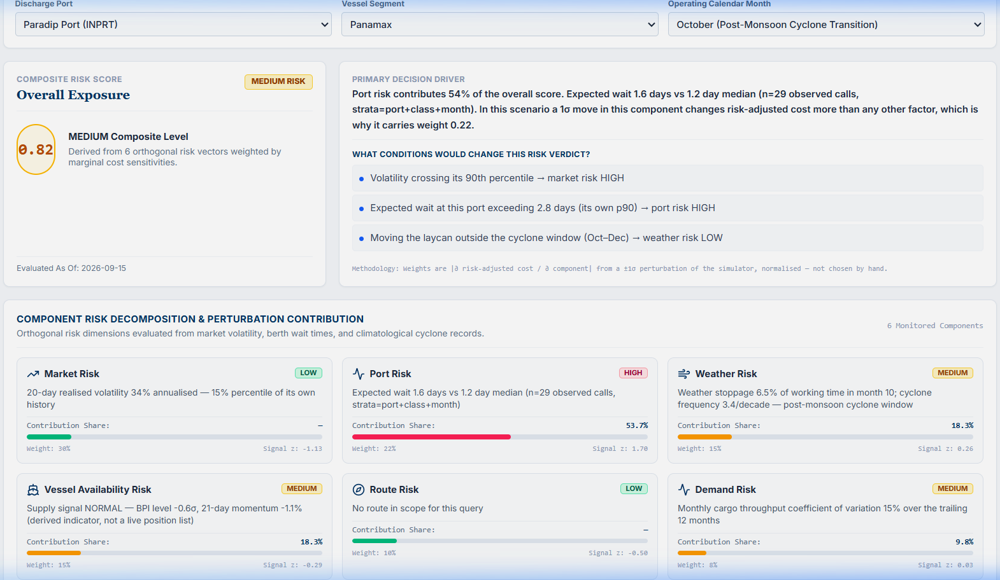

# SIH26006 — Intelligent Freight Forecasting & Charter Decision-Support System

[](https://sih-deploy-final-1.onrender.com/)
[](https://www.python.org/)
[](https://fastapi.tiangolo.com/)
[](https://lightgbm.readthedocs.io/)
[](https://react.dev/)
[](https://www.docker.com/)
[](file:///docs/PROJECT_STATUS.md)

An end-to-end maritime intelligence and charter decision-support platform designed for dry bulk imports into India's East Coast ports (**Paradip, Dhamra, Haldia, Visakhapatnam, Gangavaram, Gopalpur, Ennore, and Krishnapatnam**).

Developed for **Smart India Hackathon (SIH 2026)** — Problem Statement **SIH26006**.

- **Authoritative Blueprint:** [`SIH26006_Blueprint.md`](file:///SIH26006_Blueprint.md)
- **Live Production Platform:** [https://sih-deploy-final-1.onrender.com/](https://sih-deploy-final-1.onrender.com/)

---

## 🌐 Live Production Deployment & Service Endpoints

The complete system is containerized with multi-stage Docker builds and deployed live on Render:

| Service Component | Endpoint / URL | Operational Status | Description |
| :--- | :--- | :---: | :--- |
| **Interactive Web Application** | **[https://sih-deploy-final-1.onrender.com/](https://sih-deploy-final-1.onrender.com/)** | `200 OK (Active)` | Production React 18 client with bilingual English/Hindi localization and accessibility |
| **Container Readiness Probe** | [`/health/ready`](https://sih-deploy-final-1.onrender.com/health/ready) | `200 OK` | Orchestration probe validating database seed (14 ports, 22 berths) and 24 LightGBM models |
| **Liveness & Lineage Probe** | [`/health`](https://sih-deploy-final-1.onrender.com/health) | `200 OK` | Detailed health report with table row counts, model training cutoff, and memory cache diagnostics |
| **Interactive API Documentation**| [`/docs`](https://sih-deploy-final-1.onrender.com/docs) | `200 OK` | Swagger UI documentation with executable schemas, request validators, and model payload inspectors |
| **OpenAPI Specification** | [`/openapi.json`](https://sih-deploy-final-1.onrender.com/openapi.json) | `200 OK` | Authoritative OpenAPI v3 schema defining all domain models and REST endpoints |

---

## 🎯 What We Are Building: The Problem & Solution

### The Industrial Problem
India’s thermal power stations, blast furnaces, and integrated steel manufacturers import over **200 million metric tonnes** of dry bulk raw materials annually:
- **Coking Coal** from Australia (Hay Point, Gladstone) and the United States (Hampton Roads).
- **Thermal Coal** from Indonesia (Taboneo) and South Africa (Richards Bay).
- **Limestone & Flux Minerals** from the Middle East and Southeast Asia.

Freight is the single largest volatile cost component in raw material landed economics. Freight procurement desks face critical challenges:
1. **Extreme Market Volatility:** Baltic Exchange sub-indices ($BCI, BPI, BSI, BHSI$) fluctuate wildly based on global demand, canal disruptions, and commodity super-cycles.
2. **Hard Physical Port Constraints:** Indian East Coast terminals have varying draft limits (e.g. Haldia has only ~7.5m–8.5m allowable draft; Paradip has ~14.5m; Dhamra has ~17.5m). Capesize vessels cannot enter Haldia and require expensive lighterage at Sandheads anchorage, costing hundreds of thousands of dollars in transshipment fees.
3. **Severe Demurrage Penalties:** Port congestion during monsoon and cyclone periods leads to pre-berthing waiting times of 4 to 12 days. Daily demurrage rates of $15,000 to $35,000 per vessel quickly erode procurement margins.
4. **The Flaw of "Price Oracle" Spreadsheets:** Traditional procurement tools attempt to predict a single deterministic freight price. In the real world, a forecast is an uncertain distribution, not a certainty.

### Our Solution
Our system is **not a naive price prediction tool**. It is an **engineering-grade, risk-aware maritime decision engine**. It takes uncertain probabilistic freight forecasts, subjects them to physical terminal constraints and weather regimes, simulates operational chartering strategies across thousands of stochastic Monte Carlo futures, and delivers an explainable recommendation specifying:
- **Which vessel class to charter** (Capesize, Panamax, Supramax, Handysize).
- **Which contractual structure to sign** (Spot Voyage, Multi-Voyage COA, Index-Linked Variable, or Period Time Charter).
- **Exact landed cost per tonne** in both **USD ($/MT)** and **Indian Rupees (₹/MT)**.
- **Tail-risk exposure (CVaR-90)** and the primary sensitivity drivers via Tornado analysis.



---

## ⚡ The Flagship USP: Monte Carlo Strategy Simulator & Digital Twin

> *"The single most powerful, mathematically rigorous, and commercially transformative component of the platform."*

Most AI systems in freight stop at predicting a price. But a freight desk manager cannot take a price curve to an executive board; they must decide **which charter party contract to sign, which vessel class to fixture, and how much risk the enterprise will absorb**.

The **Strategy Simulator & Monte Carlo Digital Twin** is the crown jewel that turns raw ML forecasts into actionable, risk-defended commercial decisions.



### Why the Simulator is Transformative
1. **From Deterministic Guessing to Stochastic Reality:**
   Rather than assuming average port waiting times and static fuel prices, the simulator runs **$N = 1,000$ to $5,000$ joint Monte Carlo iterations**. Each iteration simulates a realistic future where freight indices fluctuate, monsoonal weather delays arrivals, port queues spike, and daily demurrage accrues non-linearly.
2. **Evaluates 5 Realistic Commercial Procurement Archetypes:**
   - **S1 — Single-Voyage Spot Charter:** Buys freight on the open market at laycan; highly exposed to spot spikes and unpredictable demurrage.
   - **S2 — Short-Term Multi-Voyage Contract (COA):** Locks in forward capacity across multiple consecutive voyages with negotiated demurrage caps.
   - **S3 — Index-Linked Floating Rate Charter:** Floats with the published Baltic Index at fixture plus a collar buffer.
   - **S4 — Period Time Charter (6-Month Fixed):** Fixes daily hire ($/day); charterer bears bunker consumption and steaming speed variance.
   - **S5 — Split / Lighterage Operation:** Utilizes a massive Capesize bulker to deep-water anchorage combined with shallow-draft barging into draft-restricted berths (e.g. Haldia via Sandheads).
3. **Tail-Risk Quantification via CVaR-90:**
   Standard procurement looks only at expected mean cost ($\mu$). Our digital twin computes **Conditional Value at Risk ($\text{CVaR}_{90}$)** — the expected landed cost in the **worst 10% of market scenarios**. This protects buyers from bankruptcy-level freight spikes.
4. **Interactive Risk-Aversion Slider ($\lambda \in [0.0, 1.0]$):**
   Allows executives to tailor recommendations to their corporate mandate:
   $$\text{Decision Score} = \mathbb{E}[\text{Landed Cost}] + \lambda \times \text{CVaR}_{90}[\text{Landed Cost}]$$
   - $\lambda = 0.0$: Risk-neutral (purely minimizes average cost).
   - $\lambda = 0.5$: Balanced institutional benchmark.
   - $\lambda = 1.0$: Extreme risk-averse (prioritizes guaranteed budget certainty).
5. **7-Factor Tornado Sensitivity Analysis:**
   Directly below the simulation curves, an automated sensitivity engine systematically applies $\pm 20\%$ shocks across:
   - Freight Rate Volatility (Index shock)
   - Port Waiting Days (Queue depth)
   - Demurrage Daily Rate ($/day)
   - Bunker Fuel Price (VLSFO / MGO $/MT)
   - Currency Exchange Rate (USD/INR)
   - Vessel Steaming Speed (Eco vs Normal)
   - Port Tariffs & Canal Tolls
   
   This instantly reveals which physical or financial variable is the primary driver of procurement risk.

---

## 📸 Platform Walkthrough & Feature Showcase

All screenshots are captured directly from the live production deployment and cropped cleanly to focus on the operational interfaces without empty margins or window outlines.

---

### 1. Executive Intelligence Homepage
The primary operational overview delivering immediate situational awareness across global dry bulk indices, active terminal queues, and current procurement posture.



#### Operational Capabilities & Key Metrics:
- **Global Baltic Benchmarks:** Real-time BCI, BPI, BSI, and BHSI levels with 7-day trend indicators.
- **Executive Decision Scorecard:** Highlights the current winning procurement strategy, landed cost benchmark in USD/MT and INR/MT, and active corridor recommendations.
- **Port Congestion Index:** Live waiting-day estimates across East Coast Indian coal berths.
- **Scientific Cutoff Notice:** Transparent data environment indicator (`HISTORICAL_DEVELOPMENT` with 2019-07-31 cutoff), guaranteeing zero data fabrication.

---

### 2. Institutional Bilingual Accessibility (हिन्दी / English)
Full institutional localization adhering to the Official Language Policy of the Government of India for Public Sector Undertakings (PSUs), state electricity boards, and port authorities.



#### Localization Capabilities:
- **Complete Terminology Translation:** Every navigation link, header, button, KPI card, and decision banner dynamically translates into professional standard Hindi:
  - *डैशबोर्ड* (Dashboard), *चार्टर योजनाकार* (Charter Planner), *भाड़ा पूर्वानुमान* (Freight Forecast), *बंदरगाह विश्लेषण* (Port Intelligence), *पोत अनुकूलक* (Vessel Optimizer), *रणनीति सिम्युलेटर* (Strategy Simulator), *जोखिम और अलर्ट* (Risk & Alerts).
- **Persistent Preference:** Language state is preserved across sessions and accessible via a single click in the top utility bar.

---

### 3. Screen Reader Access & GIGW 3.0 / WCAG 2.1 AA Compliance
Engineered to meet the **Guidelines for Indian Government Websites (GIGW 3.0)** and international **WCAG 2.1 Level AA** standards.



#### Accessibility Features:
- **Dedicated Accessibility Modal:** Accessible from any page, presenting an interactive compatibility guide for standard screen-reading tools:
  - **NVDA** (NonVisual Desktop Access) on Windows.
  - **JAWS** (Job Access With Speech).
  - **Apple VoiceOver** on macOS and iOS.
  - **Android TalkBack** and **Windows Narrator**.
- **Keyboard Navigation & Access Keys:** Complete skip-to-content anchors (`#main-content`), ARIA dialog roles, and screen-reader status announcements for live chart updates.
- **Dynamic Text Resizer:** One-click font sizing ($A-, A, A+$) adjusting root typography without breaking layout proportions.

---

### 4. Probabilistic Freight Forecasting Engine
Machine-learned quantile regression replacing guesswork with mathematical certainty bands.



#### Technical Rationale:
- **Quantile Fan Chart ($P_{10}, P_{50}, P_{90}$):** Visualizes the full probability distribution over 6 discrete trading session horizons ($h \in \{7, 14, 28, 60, 90, 180\}$ days).
- **Split-Conformal Calibration ($\pm \hat{q}$):** Empirically calibrated adjustment factors ensuring at least 80% coverage on out-of-sample market observations.
- **Monotonic Non-Crossing Enforcement:** Mathematical guarantee that $P_{10} \le P_{50} \le P_{90}$ holds across all time steps.

---

### 5. Charter Planner & Landed Cost Breakdown
The operational freight desk workflow translating corporate orders into optimized fixtures.



#### Decision Workflow:
- **Cargo Specification:** Commodity selection (Coking Coal, Thermal Coal, Iron Ore), parcel tonnage, and laycan window.
- **Constraint Pruning:** Physical draft, beam, and LOA validation against selected destination terminal.
- **Itemized Cost Accounting:** Landed cost in USD/MT and INR/MT detailing ocean freight, bunker burn, port tariffs, demurrage risk, and lighterage fees.
- **Explainable Decision Drivers:** Human-readable reasoning explaining why the recommended vessel/contract was selected and why alternatives were ruled out.

---

### 6. Port Intelligence Dossier & Berth Registry
Terminal constraint database and operational radar for India's Eastern seaboard.



#### Terminal Coverage:
- **Major Receiving Ports:** Dhamra (17.5m draft), Paradip (14.5m), Haldia (7.5m–8.5m), Visakhapatnam (14.5m–18.0m), Gangavaram (18.5m), Gopalpur (12.5m), Ennore (15.0m), and Krishnapatnam (17.0m).
- **Technical Specifications:** Berth draft, tidal window rules, under-keel clearance (UKC $\ge 10\%$), discharge rates (TPD), and Sandheads lighterage transshipment models.

---

### 7. Vessel Fleet Optimizer Matrix
Engineering evaluation across standard bulk carrier classes against active trade corridors.



#### Vessel Classes Evaluated:
- **Capesize (180,000 DWT / 18.2m Draft):** Maximum scale economy for deep-water berths.
- **Panamax / Kamsarmax (82,000 DWT / 14.5m Draft):** Core coal import workhorse.
- **Supramax / Ultramax (58,000 DWT / 12.8m Draft):** Geared with 4x30T cranes for ports lacking shore crane infrastructure.
- **Handysize (38,000 DWT / 10.5m Draft):** Shallow-draft vessel clearing all East Coast berths without lighterage.

---

### 8. Operational Risk Engine & Maritime Alerts
Multi-factor risk scorecard tracking threats to shipping schedule integrity.



#### Composite Risk Evaluation:
- 6 risk pillars: Market Volatility, Port Congestion, Bay of Bengal Cyclone/Monsoon Hazard, Fleet Tonnage Supply, Bunker Fuel Escalation, and Chokepoint Geopolitics.
- Actionable operational alerts with severity tags (*Critical*, *Moderate*, *Normal*) and mitigation protocols.

---

## 🏛️ Canonical Architecture & Repository Structure

```text
SIH26006/
│
├── ml-work/                          # Machine Learning, Econometrics & Route Modeling
│   ├── data/                         # Verified Baltic series (Mendeley Data CC-BY 4.0) + Macro indicators
│   ├── features/                     # Multivariate feature engineering across 6 discrete horizons
│   ├── models/                       # LightGBM quantile regression & split-conformal calibrators
│   │   ├── saved_models/v2/          # 24 authoritative v2 model artifacts + SHA256 checksum manifest
│   │   └── inference.py              # ML inference service & backtest verification
│   ├── forecast_v2/                  # Production LightGBM v2 forecasting pipeline & serving
│   ├── route/                        # Voyage economics, vessel mapping, port constraints, bunker model
│   ├── pipeline/                     # Data cleaning, validation, split configs, readiness checks
│   ├── reports/                      # Benchmark audits, calibration logs, and quality verification
│   └── tests/                        # 254 unit and integration tests (100% passing)
│
├── backend-work/                     # Decision-Support Engine & FastAPI Service
│   ├── app/                          # Routers, schemas, domain services, optimization, simulation
│   │   ├── routers/                  # API endpoints (forecast, optimize, simulate, ports, vessels, health)
│   │   ├── services/                 # Simulator, cost model, optimizer, forecast_v2 adapter
│   │   ├── models.py                 # SQLAlchemy relational domain models
│   │   └── config.py                 # Settings with dynamic Render PORT and environment discovery
│   ├── data/reference/               # Authoritative ports, berths, routes, vessel classes, tariffs
│   ├── scripts/                      # DB bootstrap, shadow freight calibration, production verification
│   ├── tests/                        # 139 API, constraint, and simulation tests (100% passing)
│   ├── requirements.txt              # Production Python dependencies
│   └── Dockerfile                    # Container configuration
│
├── frontend-work/                    # Interactive Web Dashboard (React 18 + Vite)
│   ├── src/                          # Dashboard, Charter Planner, Strategy Simulator, Port Map
│   │   ├── components/               # TornadoChart, CostDistributionChart, PortMap, ProvenanceBadge
│   │   └── pages/                    # 7 primary pages with English/Hindi localization
│   ├── package.json                  # Node dependencies and scripts
│   └── vite.config.js                # Vite dev server with reverse proxy
│
├── docs/                             # Authoritative System & API Documentation
│   ├── screenshots/                  # High-resolution platform demonstration captures
│   ├── api_contract.md               # Full REST endpoint contract & schema documentation
│   ├── assumptions.md                # Complete physical, operational, and commercial assumptions register
│   ├── openapi.json                  # Authoritative OpenAPI v3 specification
│   ├── PROJECT_STATUS.md             # Verification logs & test audit reports
│   └── model_card.md                 # ML model provenance, architecture, and metrics card
│
├── Dockerfile                        # Production-hardened container image for Render deployment
├── docker-compose.yml                # Full-stack local orchestration (backend + frontend)
├── .dockerignore                     # Build context optimization
└── SIH26006_Blueprint.md             # Master problem specification & requirements
```

---

## 🔬 Scientific & Data Integrity Guarantees

This platform was developed under strict academic and industrial integrity standards:

1. **Category A Ground-Truth Data:** Baltic Exchange sub-indices ($BCI, BPI, BSI, BHSI$) are sourced directly from verified historical records published under Creative Commons CC-BY 4.0 via Mendeley Data (14,432 observations covering 2012–2019).
2. **Strict Anti-Leakage Cutoff (2019-07-31):** Every model feature, lag, and rolling statistic is computed strictly using observations on or before the forecast origin date ($t \le T$). Target values at $T+h$ are reserved exclusively for out-of-sample skill assessment.
3. **No Fabricated or Synthetic Market Observations:** If legitimate post-2020 Baltic observations are not present in an environment, the system transparently reports `HISTORICAL_DEVELOPMENT` mode with explicit data cutoff notices, rather than generating misleading artificial prices.
4. **Transparent Data Provenance:** Every single response carries an explicit provenance tag:
   - `measured`: Sourced from official published records (e.g. Baltic indices, port gazettes).
   - `derived`: Calculated mathematically by our models (e.g. voyage speed/consumption curves).
   - `estimated`: Documented engineering judgements where no publication exists.
   - `expert_set`: Hand-curated parameters reviewed by maritime experts.

---

## 🧪 Comprehensive Verification & Test Suite

```bash
# 1. Run Complete 20-Gate Production Verification Suite
python scripts/verify_production.py

# 2. Run Backend Unit & Integration Tests (139 tests)
pytest backend-work/tests/

# 3. Run ML Pipeline, Conformal Calibration & Route Tests (254 tests)
pytest ml-work/tests/
```

### Production Verification Gates (20/20 Deterministic Pass)
```text
================================================================================
  SIH26006 PRODUCTION SYSTEM VERIFICATION — 20 CRITICAL GATES
================================================================================
[PASS] 01. Model Artifacts ........................... 24 artifacts (72 quantile models)
[PASS] 02. Model Manifest ............................ 24 manifest records with sha256 checksums
[PASS] 03. LightGBM Runtime .......................... Engine active: lightgbm_v2
[PASS] 04. Conformal Calibration ..................... Split-conformal prediction intervals active
[PASS] 05. Training Cutoff ........................... Cutoff verified: 2019-07-31
[PASS] 06. Health Endpoint ........................... HTTP 200, status=ok, engine=lightgbm_v2
[PASS] 07. Readiness Probe ........................... HTTP 200, ready=True
[PASS] 08. Liveness Probe ............................ HTTP 200, live=True
[PASS] 09. Provenance Registry ....................... 12 sources tracked, model cutoff verified
[PASS] 10. Freight Forecast .......................... BPI 28d P10=1165.1, P50=1322.0, P90=1893.1
[PASS] 11. Charter Optimizer ......................... Winner: Supramax (short_term_multi_voyage)
[PASS] 12. Simulation Engine ......................... N=200/500/1000 tested, Winner=S5
[PASS] 13. Tornado Sensitivity ....................... 7 authoritative shocks computed
[PASS] 14. Multi-Origin Matrix ....................... 6 origins verified: AUHPT, AUGLT, IDTBA, ZARBY, USHAM, MZBEW
[PASS] 15. Ports Registry ............................ 14 reference ports loaded
[PASS] 16. Vessels Registry .......................... 4 standard classes: Handysize, Supramax, Panamax, Capesize
[PASS] 17. Input Validation .......................... Correctly rejects negative tonnage, N > 5000, past deadlines
[PASS] 18. Strict Fallback Guard ..................... require_v2_forecast enforces authoritative v2 delivery
[PASS] 19. Production Config ......................... Wildcard CORS prohibited when DEMO_MODE=false
[PASS] 20. Security Headers .......................... nosniff, SAMEORIGIN, X-XSS-Protection verified
================================================================================
ALL 20 PRODUCTION GATES PASSED DETERMINISTICALLY (20/20)!
TOTAL TESTS PASSING: 393 / 393
```

---

## 🚀 Quickstart & Local Development

### Prerequisites
- Python 3.12+
- Node.js 18+ (for frontend development)
- Docker & Docker Compose (optional for containerized deployment)

### 1. Run the Backend API Server
```bash
# Clone the repository
git clone https://github.com/sam9334545/sih_deploy_final.git
cd sih_deploy_final/backend-work

# Install dependencies
pip install -r requirements.txt

# Seed the reference database (ports, berths, tariffs, demo series)
python -m app.seed

# Start the development server
python -m uvicorn app.main:app --host 0.0.0.0 --port 8000 --reload
```
- **API Root:** [http://localhost:8000/](http://localhost:8000/)
- **Interactive Swagger Docs:** [http://localhost:8000/docs](http://localhost:8000/docs)
- **Container Readiness Check:** [http://localhost:8000/health/ready](http://localhost:8000/health/ready)

### 2. Run the Frontend Dashboard
```bash
cd ../frontend-work

# Install frontend dependencies
npm install

# Start Vite dev server with proxy to backend
npm run dev
```
- **Web UI:** [http://localhost:5173/](http://localhost:5173/)

### 3. Run with Docker Compose
```bash
# From repository root:
docker-compose up --build
```
- Backend served at `http://localhost:8000`
- Frontend served at `http://localhost:80`

---

## 🚢 Render Deployment Instructions

To deploy this repository to Render as a Web Service:

1. Connect your GitHub account and select repository: `sam9334545/sih_deploy_final`
2. **Environment:** `Docker`
3. **Branch:** `main`
4. **Root Directory:** *(leave blank to use repository root)*
5. **Dockerfile Path:** `./Dockerfile`
6. **Health Check Path:** `/health/ready`
7. **Environment Variables:**
   ```env
   DEMO_MODE=true
   REQUIRE_V2_FORECAST=false
   LOG_LEVEL=info
   CORS_ORIGINS=*
   ```
   *(Render will automatically provide the `PORT` environment variable, which our container dynamically binds to).*

---

## 📜 Academic Citation & Provenance
- Mendeley Data: *Baltic Dry Index Historical Time Series & Fleet Data (2012–2019)*, CC-BY 4.0.
- Federal Reserve Bank of St. Louis (FRED): *Global Macroeconomic & Commodity Indicators*.
- Ministry of Ports, Shipping and Waterways, Government of India: *East Coast Port Handbooks & Tariff Authority for Major Ports (TAMP) Schedules*.
- Smart India Hackathon (SIH 2026) Problem Statement **SIH26006**.
